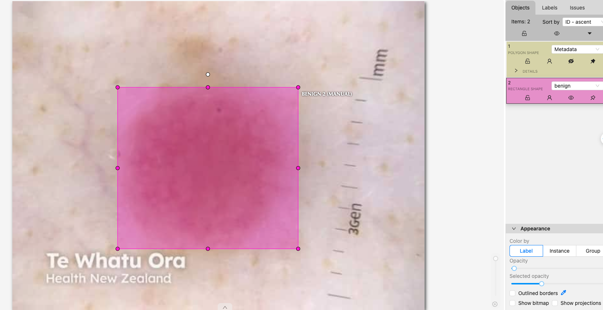
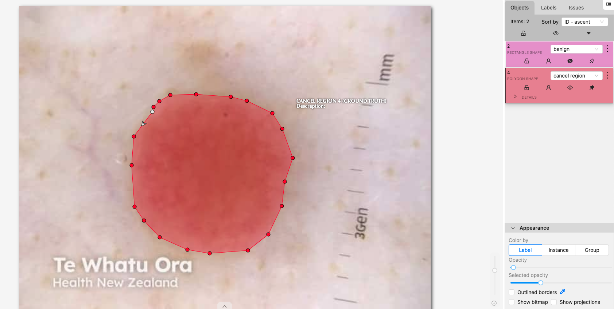
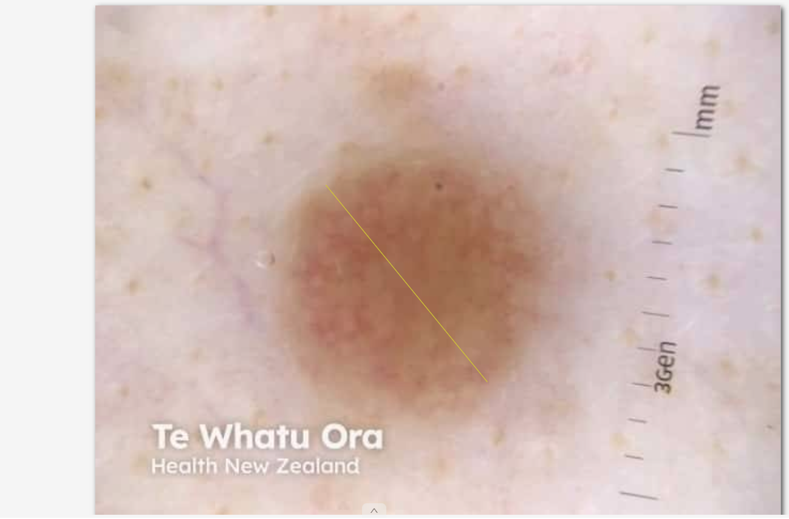

# CVAT Annotation Guide for Medical Professionals

This guide provides a concise overview of the Computer Vision Annotation Tool (CVAT) for medical professionals involved in image and video annotation.  It clarifies key terms and outlines the annotation process.  For detailed instructions and advanced features, refer to the official CVAT documentation.

## Key Terms and Concepts

* **Project:** A high-level organizational unit representing a complete annotation study or a specific research area.  A project groups related tasks together.  Think of it like a folder for multiple related annotation jobs.

* **Task:** A specific annotation job within a project. Each task focuses on a particular annotation goal (e.g., identifying specific anatomical structures in a set of X-rays). One project can contain numerous tasks.

* **Annotation Job:** The actual process of annotating images or videos within a given task. This is the core work of the annotator.  The task is a collection of individual annotation jobs.

* **Annotation Types:** CVAT supports various annotation methods:
    * **Bounding Boxes:** Rectangular boxes around objects of interest.  
      
    * **Polygons:** Irregular shapes precisely outlining objects.  
      
    * **Points:** Marking specific locations.
    * **Polylines:**  Marking lines or paths.  
      
    * **Cuboids (3D):**  For annotating three-dimensional data (if applicable to your project).

## Workflow

1. **Account Access:** Obtain login credentials from your project administrator.

2. **Project Overview:** Familiarize yourself with the project's goals and annotation guidelines. This information will be provided by your administrator or within the project itself in CVAT.

3. **Task Assignment:**  You'll be assigned one or more tasks within a project. Each task has detailed instructions specifying the type of annotations required, the labels to use, and any specific guidelines.

4. **Annotation:** Proceed through the images or videos within the assigned task, carefully adding annotations using the appropriate tools provided by CVAT.  Regularly save your work.

5. **Quality Control:** Upon completion, submit your annotations.  Your work may be subject to review by other annotators or supervisors to ensure accuracy and consistency.  Follow any provided quality control guidelines.

6. **Data Formats:**  CVAT supports various data output formats for use in machine learning training pipelines. The required format will be specified by your project administrator.

## Additional Resources

* **CVAT Official Documentation:**  Consult the official documentation for detailed tutorials, advanced features, and troubleshooting assistance.

* **Project Administrator:**  Your project administrator can provide specific guidance and support throughout the annotation process.  They are your main point of contact for any questions.

This guide provides a basic understanding of the CVAT annotation process relevant to medical image and video annotation. Remember to always refer to the specific project guidelines and official CVAT documentation for detailed instructions and best practices.
